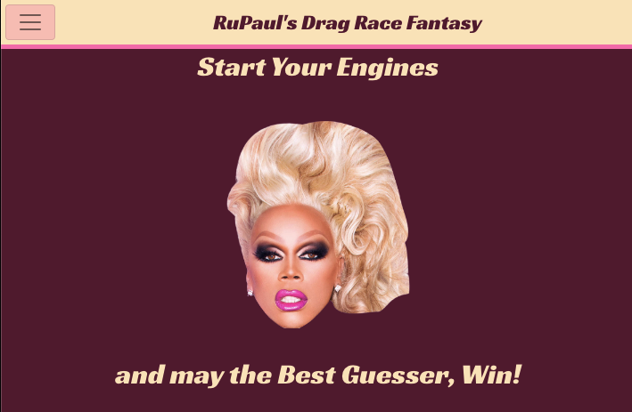

# RPDR Fantasy

## Deployed link
[Click Here!](https://dragrace-fantasy.herokuapp.com/)

## Objective
I'm a big fan of RuPaul's Drag Race (RPDR), and after years of watching I recently started playing in a fantasy league with some friends. In the fantasy league each person has a roster of four queens, and each week you select the two queens you think will perform the best. Points are assigned each week depending on how each queen performs. We previously had been using a google spreadsheet to track everyone's guesses/points, and I thought it would be a fun project to try and make a web app that would mimic the fantasy league and automate the scoring system for us.

This project is a decoupled application. This is the repository for the front-end, but the back-end repo can be found [here](https://github.com/hbarrons/rpdrFantasy-react-backend-)!

This project was originally built with a MEN stack as a project while I was in coding bootcamp (General Assembly), and post graduation I decided to expand on the project to make it a fully functioning game, while also converting the project to a MERN stack/React app. The original project can be found [here](https://github.com/hbarrons/rpdr-fantasy)!

## Home Screen

## How To Play

1. Sign up for an account
   * Create a League (if you create a league, you will be the admin for that league)
   * Join a League (in order to join a league you will need to get the league name and number from the admin)
2. The admin will be responsible for adding the queens from the season to the "Build Roster" page
3. Once the Queens are added, players are able to build their roster by choosing 4 queens. Once your initial roster is built you are only allowed to drop/add one queen per week.
4. Once your roster is built you can make your weekly guess
5. Once each player makes a guess, and after the episode airs, the admin can enter the results and calculate the scores with the click of a button on the Episodes page.
6. That's all! Make roster adjustments throughout the season and enter the results each week until the finale airs and a winner is crowned. Good Luck!

Note: this app is designed to be reusable. Once a season is over the admin can delete the queens and the episodes and start again fresh once a new season airs.

## Technologies Used:

 

## Future Enhancements
- Incorporate ability to join multiple leagues
- Implement unit testing using Jest to limit bugs and enhance performance
- Allow personalization of profile view (ie. allow players to add a profile picture, their favorite queen/quotes, favorite season, etc.)
- Add ability for admin to set a time for guesses/roster moves to be locked in

## Credits
The Queen herself 🙌 RuPaul🙌   - thank you for creating this amazing show! 

